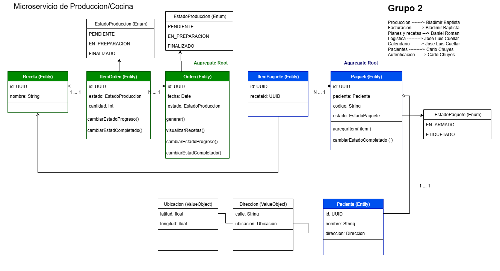
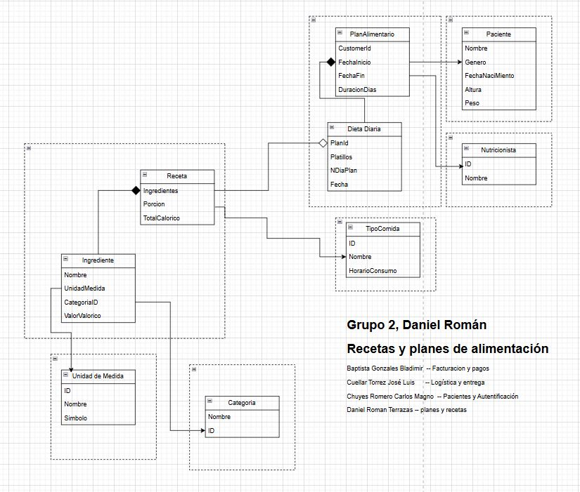

La carpeta `domain/` contiene los siguientes aggregados y entidades:

- `Client/`
	- `Client.ts`, `ClientError.ts` y `ValueObjects/` (dirección, coordenadas).
- `Ingredient/`
	- `Ingredient.ts`, `IngredientError.ts`.
- `MeasurementUnit/`
	- `MeasurementUnit.ts`, `MeasurementUnitError.ts`.
- `Recipe/`
	- `Recipe.ts`, `RecipeError.ts`.
- `Order/` (AgregateRoot)
	- `Order.ts`, `OrderError.ts`, `IOrderRepository.ts`, `StatusOrderEnum.ts`, `events/`.
- `OrderItem/` (definición de items dentro de pedido).
- `Package/`(AgregateRoot) y `PackageItem/`
	- `Package.ts`, `IPackageRepository.ts`, `StatusPackage.ts`, `events/`.
- `shared/`
	- `abstractions/` contiene clases e interfaces bases (AggregateRoot, DomainEvent, Entity, IRepository, IUnitOfWork, ValueObject).
	- `Errors/` contiene errores generales.
	- `results/` contiene excepciones de dominio.

El microvicio al que corresponde este proyecto es al de Produccion/Cocina, debido a la integracion del microservicio de PlanAlimenticio/Receta se a adicionado el diagrama del mismo.

# ddd-proyect
